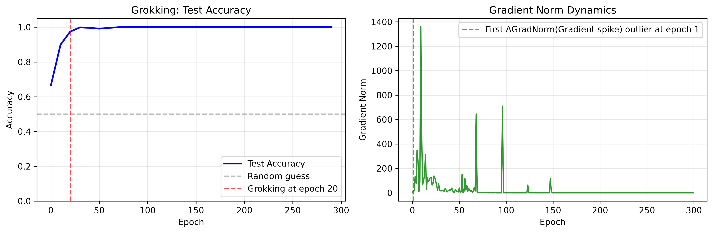
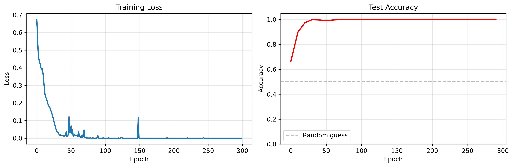
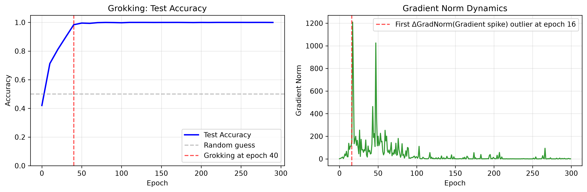
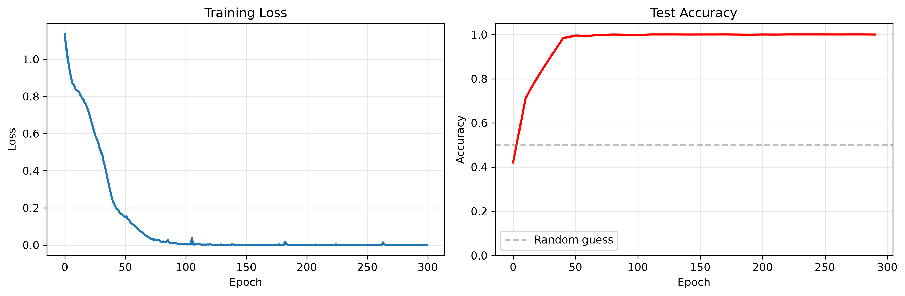
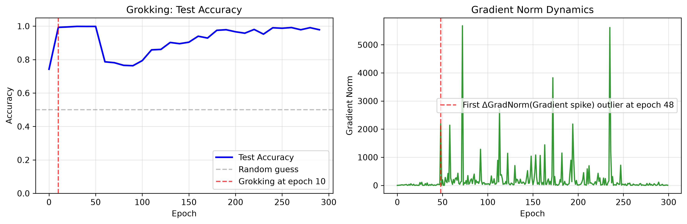
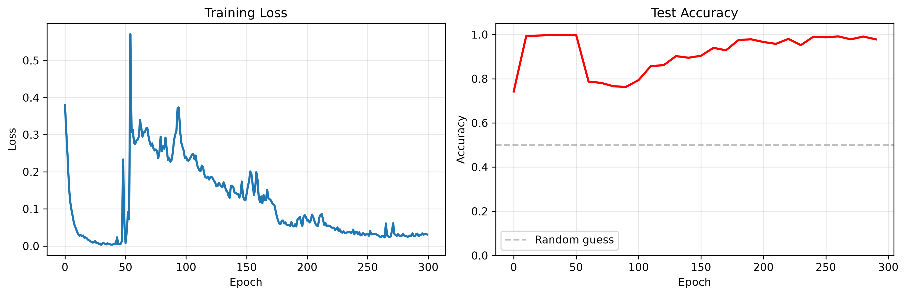

### Single CSP Block

Each block has four stages:

    z_t ──► Rotate ──► Recur ──┐
         │                     │
         └───── Skip ──────────┼──► (+) ──► Norm ──► h_t

- **Rotate**: `z~_t = e^(i*theta_t) ⊙ z_t`
- **Recur**: `h_t = alpha_t * h_{t-1} + gamma_t * z~_t`
- **Skip**: `h~_t = h_t + z_t`
- **Norm**: `h_t^(l) = h~_t / |h~_t|`

# Complex State Propagator (CSP)

**State Propagation Also Satisfies: A Complex-Valued State-Space Model for Deterministic State Tracking**

## TL;DR

We propose **CSP (Complex State Propagator)**, a minimalistic recurrent architecture that **only propagates hidden states** across layers, without output projections at intermediate steps. The state is complex-valued and updated via learned rotations.

On the training length (T = 16), CSP reaches **100% accuracy** on Parity Check, Mod-3 Counting, and Parenthesis Matching. Length generalization is evaluated separately: models are trained at T = 16 and tested up to T = 64 (4× the training length). See the Results section below for the full comparison against five baselines.

**Key insight:** In standard Mamba, `h -> y = C h -> next_h = B(y) = B C h`. The two projections can be fused. Why not just propagate `h` directly?

If you find this work useful, please cite it in your paper:

    @article{li2026state,
      title={State Propagation Also Satisfies: A Complex-Valued State-Space Model for Deterministic State Tracking},
      author={Li, Xiaohe and Lu, Yang},
      journal={arXiv preprint arXiv:2608.03425},
      year={2026}
    }

---

> **Development Status**
>
> The CSP family is **under active development**. This repository tracks the latest experimental results and may not be fully consistent with the version described in our arXiv paper.
>
> Two variants are currently maintained:
>
> - **CSP-Vanilla** — the iterative reference implementation, with state rotation applied through a sequential recurrence.
> - **CSP-Fast** — a parallel formulation using accumulated-phase rotation sensing.
>
> Recent modifications: the rotation projection was changed from `tanh(·)·π` to `atan2(·)`, and the embedding table is frozen during training. All results below reflect these changes.

---

## Dataset Note

The Parenthesis dataset construction uses the **Dyck-1 style** format:

- Standard valid-prefix labeling
- Tokens remapped to embedding indices (left = 1, right = 2, pad = 0)
- Labels: `1` if the prefix is a valid Dyck-1 prefix, `0` otherwise, `-100` for padding

Older checkpoints may use a different construction and are not directly comparable.

---

## Architecture

CSP is a minimal recurrent architecture that **only propagates hidden states** across layers, without output projections at intermediate steps.

### Overall Flow

    Input x (T steps)
        │
        ▼
      Embedding
        │
        ▼
      CSP Block 1 ──► h^(1)
        │
        ▼
      CSP Block 2 ──► h^(2)
        │
        ▼
        ...
        │
        ▼
      CSP Block L ──► h^(L)
        │
        ▼
      Phase Decoder (atan2 -> [cos, sin])
        │
        ▼
      Output y_hat

### Key Principles

1. **State-Only Propagation** – No output projections between layers.
2. **Complex Rotation** – Rotation angle extracted as `atan2(tanh(W_θ z_t))` from a 2D projection, without magnitude bounding.
3. **Phase Decoding** – Final prediction from `atan2(Im(h), Re(h))`.
4. **Block-Level SiLU** – Nonlinearity only at block boundaries.

### CSP-Fast: Accumulated-Phase Variant

CSP-Fast computes the per-step rotation angle directly from the **accumulated phase** of the input sequence:

    theta_all = cumsum( atan2( tanh( theta_proj( x_t ) ) ) )

The `atan2` projection maps the input to a 2D point whose angle is the phase increment. Since the rotation angle is a direct function of the running cumulative sum, it can be evaluated **in parallel** across all timesteps with a single `cumsum` operation.

Key properties:

- **Accumulated phase.** The rotation angle at each step is derived from the running sum of per-step phase increments.
- **Complex-eigenvalue structure.** The state transition matrix `A = a * e^(i*theta)` remains complex-valued.
- **No magnitude bounding.** The phase is extracted from the projection via `atan2`, so the magnitude of the projection is irrelevant.
- **Parallel computation.** The angle is computed in one pass over the sequence.

---

## Results

### Training (fixed length, T = 16)

Accuracy at the training length only. Length generalization is reported separately below.

| Task | Accuracy | F1 | Epochs to 100% |
|------|----------|-----|----------------|
| Parity Check | 100% | 1.0 | ~10 |
| Mod-3 Counting | 100% | 1.0 | ~10 |
| Parenthesis Matching | 100% | 1.0 | ~10 |

### Length Generalization

Trained at T = 16, evaluated up to T = 64 (4× training length). All values are **mean ± std across five seeds (42–46)**.

#### Parity

| Model | Params | L=16 | L=32 | L=64 |
|-------|--------|------|------|------|
| Vanilla RNN | 2,754 | 1.000 | 1.000 | **1.000 ± 0.000** |
| Complex RNN | 10,242 | 1.000 | 0.999 | 0.995 ± 0.007 |
| **CSP-Vanilla** | 4,779 | 1.000 | 0.922 | **0.782 ± 0.111** |
| **CSP-Fast** | 4,779 | 0.962 | 0.790 | **0.756 ± 0.089** |
| Mamba (neg. eigen) | 18,693 | 0.967 | 0.776 | 0.661 ± 0.035 |
| Transformer | 41,186 | 0.976 | 0.727 | 0.606 ± 0.009 |

#### Mod-3 Counting

| Model | Params | L=16 | L=32 | L=64 |
|-------|--------|------|------|------|
| Vanilla RNN | 2,803 | 1.000 | 1.000 | **1.000 ± 0.000** |
| Complex RNN | 10,323 | 1.000 | 1.000 | 1.000 ± 0.000 |
| **CSP-Vanilla** | 4,893 | 1.000 | 0.980 | **0.927 ± 0.076** |
| **CSP-Fast** | 4,893 | 1.000 | 0.974 | **0.684 ± 0.043** |
| Mamba (neg. eigen) | 18,742 | 1.000 | 0.803 | 0.564 ± 0.008 |
| Transformer | 41,235 | 0.999 | 0.646 | 0.484 ± 0.005 |

#### Dyck-1 (Parenthesis)

| Model | Params | L=16 | L=32 | L=64 |
|-------|--------|------|------|------|
| Transformer | 41,202 | 1.000 | 0.995 | **0.926 ± 0.083** |
| Vanilla RNN | 2,770 | 1.000 | 0.999 | 0.988 ± 0.006 |
| Complex RNN | 10,258 | 1.000 | 1.000 | 0.967 ± 0.017 |
| **CSP-Fast** | 4,795 | 0.993 | 0.966 | **0.871 ± 0.078** |
| **CSP-Vanilla** | 4,795 | 0.999 | 0.972 | **0.845 ± 0.075** |
| Mamba (neg. eigen) | 18,709 | 1.000 | 0.981 | 0.907 ± 0.044 |

### Observations

**Two tiers of length generalization.** Exact-transition models (Vanilla RNN, Complex RNN) reach ≥ 0.96 at L=64 on parity and mod-3, and ≥ 0.96 on Dyck-1, with low variance across seeds. Soft-contraction models (CSP, Mamba, Transformer) decay with sequence length.

**Mod-3 is the sharpest discriminator.** CSP-Vanilla reaches **0.927 ± 0.076** at L=64 on mod-3, versus 0.564 for Mamba and 0.484 for the Transformer — a margin of **more than 35 percentage points** over the strongest baseline. CSP-Fast reaches 0.684, also well above both baselines.

**Parity favors CSP over the baselines.** CSP-Vanilla (0.782) and CSP-Fast (0.756) both exceed Mamba (0.661) and the Transformer (0.606) by 10–18 percentage points. CSP-Vanilla reaches perfect 1.000 accuracy at L=64 on one of five seeds.

**Dyck-1 favors the Transformer.** The Transformer achieves 0.926 at L=64, the highest of any model. CSP-Fast (0.871) and CSP-Vanilla (0.845) remain competitive and outperform Mamba on this task.

**Architectural asymmetry between CSP variants.** CSP-Vanilla leads on mod-3 while CSP-Fast leads on parity and Dyck-1. The iterative and parallel forms solve the two task families with different effectiveness. CSP-Vanilla's history-aware decay is better suited to cyclic counting; CSP-Fast's accumulated-phase rotation is better suited to tasks requiring exact binary transitions.

### Grokking Phenomenon

We observe clear **grokking** on all three tasks: performance stays near chance for many epochs, then jumps sharply.

**Parity**

  
  

**Mod-3 Counting**

  
  

**Dyck-1**

  
  

**Length generalization curves (all seeds)** — available in the repository under `experiments/{task}/results/`.

---

## Quick Start

    # Clone
    git clone https://github.com/hilhert/CSP.git
    cd CSP

    # Install
    pip install -r requirements.txt
    pip install -e .

    # Run experiments
    python experiments/parity.py
    python experiments/mod3.py
    python experiments/parenthesis.py

    # Jupyter demo
    jupyter notebook notebooks/demo.ipynb

## Requirements

- torch>=2.0.0
- numpy>=1.24.0
- matplotlib>=3.7.0
- tqdm>=4.65.0
- scikit-learn>=1.3.0
- safetensors>=0.8.0

## License

This project is licensed under the MIT License — see the [LICENSE](LICENSE) file for details.

Copyright (c) 2026 Xiaohe Li

Permission is hereby granted, free of charge, to any person obtaining a copy
of this software and associated documentation files (the "Software"), to deal
in the Software without restriction, including without limitation the rights
to use, copy, modify, merge, publish, distribute, sublicense, and/or sell
copies of the Software, and to permit persons to whom the Software is
furnished to do so, subject to the following conditions:

The above copyright notice and this permission notice shall be included in all
copies or substantial portions of the Software.

THE SOFTWARE IS PROVIDED "AS IS", WITHOUT WARRANTY OF ANY KIND, EXPRESS OR
IMPLIED, INCLUDING BUT NOT LIMITED TO THE WARRANTIES OF MERCHANTABILITY,
FITNESS FOR A PARTICULAR PURPOSE AND NONINFRINGEMENT. IN NO EVENT SHALL THE
AUTHORS OR COPYRIGHT HOLDERS BE LIABLE FOR ANY CLAIM, DAMAGES OR OTHER
LIABILITY, WHETHER IN AN ACTION OF CONTRACT, TORT OR OTHERWISE, ARISING FROM,
OUT OF OR IN CONNECTION WITH THE SOFTWARE OR THE USE OR OTHER DEALINGS IN THE
SOFTWARE.
