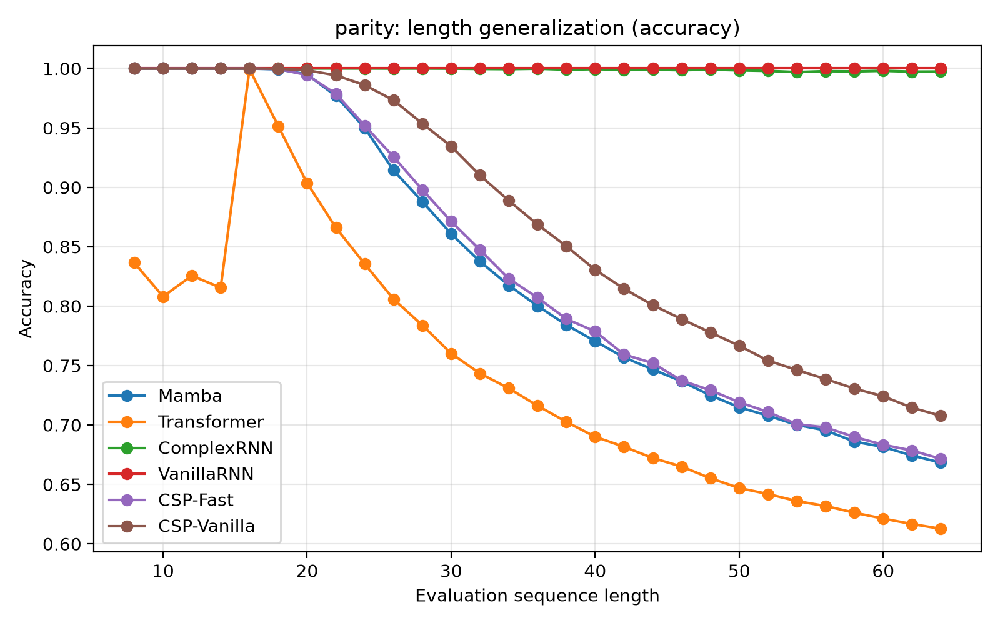
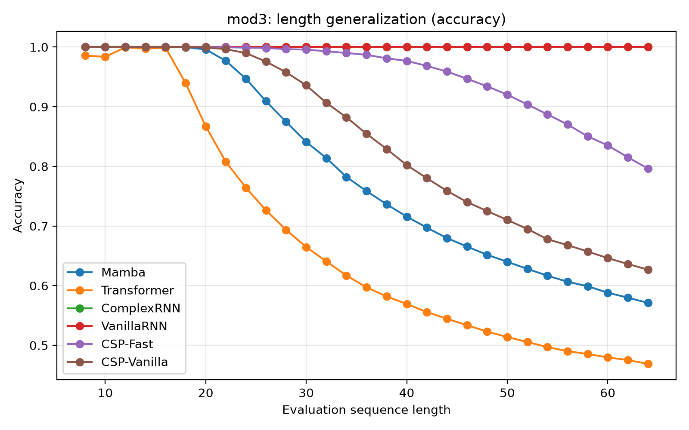
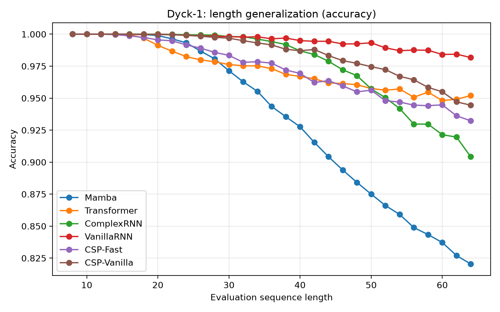

### Single CSP Block

Each block has four stages:

    z_t ──► Rotate ──► Recur ──┐
         │                     │
         └───── Skip ──────────┼──► (+) ──► Norm ──► h_t

- **Rotate**: `z~_t = e^(i*theta_t) ⊙ z_t`
- **Recur**: `h_t = alpha_t * h_{t-1} + gamma_t * z~_t`
- **Skip**: `h~_t = h_t + z_t`
- **Norm**: `h_t^(l) = h~_t / |h~_t|`

# Complex State Propagator (CSP)

**State Propagation Also Satisfies: A Complex-Valued State-Space Model for Deterministic State Tracking**

## TL;DR

We propose **CSP (Complex State Propagator)**, a minimalistic recurrent architecture that **only propagates hidden states** across layers, without output projections at intermediate steps. The state is complex-valued and updated via learned rotations.

On the training length (T = 16), both CSP variants reach **100% accuracy** on Parity Check, Mod-3 Counting, and Parenthesis Matching. Length generalization is evaluated separately: models are trained at T = 16 and tested up to T = 64 (4× the training length).

**Key insight:** In standard Mamba, `h -> y = C h -> next_h = B(y) = B C h`. The two projections can be fused. Why not just propagate `h` directly?

If you find this work useful, please cite it in your paper:

    @article{li2026state,
      title={State Propagation Also Satisfies: A Complex-Valued State-Space Model for Deterministic State Tracking},
      author={Li, Xiaohe and Lu, Yang},
      journal={arXiv preprint arXiv:2608.03425},
      year={2026}
    }

---

> **Development Status**
>
> The CSP family is **under active development**. This repository tracks the latest experimental results and may not be fully consistent with the version described in our arXiv paper. Length generalization has been **partially improved** since the original release.
>
> Two variants are currently maintained:
>
> - **CSP-Vanilla** — the iterative reference implementation, with state rotation applied through a sequential recurrence.
> - **CSP-Fast** — a parallel formulation using accumulated-phase rotation sensing. This variant is faster to train and shows strong length generalization on accumulation-style tasks (Dyck-1, Mod-3).
>
> All experiments below were run with aligned data generation across variants.

---

## Dataset Note

The Parenthesis dataset construction has been switched to the **Dyck-1 style** format:

- Standard valid-prefix labeling
- Tokens remapped to embedding indices (left = 1, right = 2, pad = 0)
- Labels: `1` if the prefix is a valid Dyck-1 prefix, `0` otherwise, `-100` for padding

Older checkpoints and results may use the previous construction and are not directly comparable.

---

## Architecture

CSP is a minimal recurrent architecture that **only propagates hidden states** across layers, without output projections at intermediate steps.

### Overall Flow

    Input x (T steps)
        │
        ▼
      Embedding
        │
        ▼
      CSP Block 1 ──► h^(1)
        │
        ▼
      CSP Block 2 ──► h^(2)
        │
        ▼
        ...
        │
        ▼
      CSP Block L ──► h^(L)
        │
        ▼
      Phase Decoder (atan2 -> [cos, sin])
        │
        ▼
      Output y_hat

### Key Principles

1. **State-Only Propagation** – No output projections between layers.
2. **Complex Rotation** – Per-dimension independent rotation, with cumulative-sum rotation-angle sensing.
3. **Phase Decoding** – Final prediction from `atan2(Im(h), Re(h))`.
4. **Block-Level SiLU** – Nonlinearity only at block boundaries.

### CSP-Fast: Accumulated-Phase Variant

CSP-Fast does **not** use an associative scan. Instead, the per-step rotation angle is computed directly from the **accumulated phase** of the input sequence:

    theta_all = cumsum( pi * tanh( theta_proj( x_t) ))

Because the rotation angle is a direct function of the running cumulative sum, it can be evaluated **in parallel** across all timesteps with a single `cumsum` operation — no sequential scan is needed for the angle itself.

Key properties:

- **Accumulated phase.** The rotation angle at each step is derived from the running mean of the input, which acts as the model's phase state.
- **Complex-eigenvalue structure.** The state transition matrix `A = a * e^(i*theta)` remains complex-valued, with magnitude `a` and phase `theta`.
- **Parallel computation.** The angle is computed in one pass over the sequence, avoiding a step-by-step scan.
- **Trade-off.** The cumsum-based angle is a compact way to sense accumulated phase; it is not equivalent to a full associative scan over a complex recurrence.

---

## Results

### Training (fixed length, T = 16)

Accuracy at the training length only. Length generalization is reported separately below.

| Task | Accuracy | F1 | Epochs to 100% |
|------|----------|-----|----------------|
| Parity Check | 100% | 1.0 | ~20 |
| Mod-3 Counting | 100% | 1.0 | ~60 |
| Parenthesis Matching | 100% | 1.0 | ~10 |

### Length Generalization

Trained at T = 16, evaluated up to T = 64 (4× training length).

#### CSP-Fast (5 seeds, mean ± std)

| Task | L=16 | L=32 | L=64 |
|------|------|------|------|
| Parity | 0.962 ± 0.068 | 0.790 ± 0.066 | **0.644 ± 0.034** |
| Mod-3 Counting | 0.996 ± 0.009 | 0.922 ± 0.082 | **0.723 ± 0.165** |
| Dyck-1 (Parenthesis) | 0.99997 ± 0.00003 | 0.994 ± 0.006 | **0.937 ± 0.050** |

Per-seed results:

**Parity**

| Seed | L=16 | L=32 | L=64 |
|------|------|------|------|
| 42 | 0.9998 | 0.8478 | 0.6734 |
| 43 | 0.8298 | 0.6770 | 0.5861 |
| 44 | 0.9965 | 0.7954 | 0.6485 |
| 45 | 0.9946 | 0.8199 | 0.6578 |
| 46 | 0.9905 | 0.8119 | 0.6566 |

**Mod-3 Counting**

| Seed | L=16 | L=32 | L=64 |
|------|------|------|------|
| 42 | 1.000 | 0.937 | 0.643 |
| 43 | 0.980 | 0.787 | 0.556 |
| 44 | 1.000 | 0.901 | 0.613 |
| 45 | 1.000 | 0.987 | 0.801 |
| 46 | 1.000 | 1.000 | 1.000 |

**Dyck-1 (Parenthesis)**

| Seed | L=16 | L=32 | L=64 |
|------|------|------|------|
| 42 | 0.99997 | 0.99591 | 0.95096 |
| 43 | 0.99992 | 0.99515 | 0.96298 |
| 44 | 0.99995 | 0.99547 | 0.97121 |
| 45 | 1.00000 | 0.99914 | 0.95786 |
| 46 | 1.00000 | 0.98366 | 0.84353 |

> CSP-Fast shows the strongest and most stable length generalization on Dyck-1. On Mod-3, performance is high on average but with significant seed variance — one of five seeds reaches perfect 1.000 at L=64. On Parity, CSP-Fast is competitive with the soft-contraction tier but does not reach the exact-transition tier (Vanilla RNN, Complex RNN).

#### Baseline comparison (single seed)

Baselines are shown for reference. Multi-seed runs are in progress.

| Task | Model | L=16 | L=32 | L=64 |
|------|-------|------|------|------|
| Parity | Vanilla RNN | 1.000 | 1.000 | 1.000 |
| Parity | Complex RNN | 1.000 | 1.000 | 1.000 |
| Parity | CSP-Fast | 0.962 ± 0.068 | 0.790 ± 0.066 | 0.644 ± 0.034 |
| Parity | CSP-Vanilla | 1.000 | 0.869 | 0.685 |
| Parity | Mamba (neg. eigen) | 1.000 | 0.855 | 0.679 |
| Parity | Transformer (decoder-only) | 0.996 | 0.714 | 0.589 |
| Mod-3 | Vanilla RNN | 1.000 | 1.000 | 1.000 |
| Mod-3 | Complex RNN | 1.000 | 1.000 | 1.000 |
| Mod-3 | CSP-Fast | 0.996 ± 0.009 | 0.922 ± 0.082 | 0.723 ± 0.165 |
| Mod-3 | CSP-Vanilla | 0.986 | 0.742 | 0.537 |
| Mod-3 | Mamba (neg. eigen) | 1.000 | 0.855 | 0.594 |
| Mod-3 | Transformer (decoder-only) | 0.998 | 0.638 | 0.467 |
| Dyck-1 | CSP-Fast | 0.99997 ± 0.00003 | 0.994 ± 0.006 | 0.937 ± 0.050 |
| Dyck-1 | CSP-Vanilla | 1.000 | 0.998 | 0.984 |
| Dyck-1 | Vanilla RNN | 1.000 | 0.999 | 0.984 |
| Dyck-1 | Complex RNN | 1.000 | 0.997 | 0.949 |
| Dyck-1 | Mamba (neg. eigen) | 1.000 | 0.985 | 0.838 |
| Dyck-1 | Transformer (decoder-only) | 1.000 | 0.994 | 0.992 |

> Baseline tables will be replaced with 5-seed mean ± std runs.

### Grokking Phenomenon

We observe clear **grokking** on Parity, Mod-3 Counting, and Parenthesis Matching.

**Parity**

  
  

**Mod-3 Counting**

  
  

**Dyck-1** (using F1 to demonstrate grokking, since accuracy is saturated on this problem)

  
  

**Length generalization curves** (regenerated for all models and tasks)

  
  
  

---

## Quick Start

    # Clone
    git clone https://github.com/hilhert/CSP.git
    cd CSP

    # Install
    pip install -r requirements.txt
    pip install -e .

    # Run experiments
    python experiments/parity.py
    python experiments/mod3.py
    python experiments/parenthesis.py

    # Jupyter demo
    jupyter notebook notebooks/demo.ipynb

## Requirements

- torch>=2.0.0
- numpy>=1.24.0
- matplotlib>=3.7.0
- tqdm>=4.65.0
- scikit-learn>=1.3.0
- safetensors>=0.8.0

## License

This project is licensed under the MIT License — see the [LICENSE](LICENSE) file for details.

Copyright (c) 2026 Xiaohe Li

Permission is hereby granted, free of charge, to any person obtaining a copy
of this software and associated documentation files (the "Software"), to deal
in the Software without restriction, including without limitation the rights
to use, copy, modify, merge, publish, distribute, sublicense, and/or sell
copies of the Software, and to permit persons to whom the Software is
furnished to do so, subject to the following conditions:

The above copyright notice and this permission notice shall be included in all
copies or substantial portions of the Software.

THE SOFTWARE IS PROVIDED "AS IS", WITHOUT WARRANTY OF ANY KIND, EXPRESS OR
IMPLIED, INCLUDING BUT NOT LIMITED TO THE WARRANTIES OF MERCHANTABILITY,
FITNESS FOR A PARTICULAR PURPOSE AND NONINFRINGEMENT. IN NO EVENT SHALL THE
AUTHORS OR COPYRIGHT HOLDERS BE LIABLE FOR ANY CLAIM, DAMAGES OR OTHER
LIABILITY, WHETHER IN AN ACTION OF CONTRACT, TORT OR OTHERWISE, ARISING FROM,
OUT OF OR IN CONNECTION WITH THE SOFTWARE OR THE USE OR OTHER DEALINGS IN THE
SOFTWARE.
